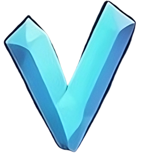

# Vocabulary Quiz


This repository makes quizes out of custom word pairs. Below is a list of features supported.

* A set of english to turskish basic words to translate
* A set of swedish to turskish basic words to translate
* Randomly samples words from vocabulary choosen to practice
* Filter vocabulary to practice based on vocabulary groups
* Means to extend/remove vocabulary and store it in localstorage, where you'd also can create custom vocabulary groups for certain needs
* Import extrenal vocabulary from url
* Persist created vocabulary in URL as a "window.location.hash" value
* Easy to add extra vocabulary in assets/vocabulary/${langToLang}.json (replace ${langToLang} with your file)
* Dark/light mode supported by chakra
* Gather statistics on improvements you have done, highlight common mistakes and offer doovers (see more in [](src/Stats.tsx))

## Installation

The following steps can be taken to easily getting started developing this project.
```
$ git clone git@github.com:jolin1337/glosboken.git
$ cd glosboken
$ npm install
$ npm run dev
```

Then go to [](http://localhost:5173/) and see the magic.

## Contributions

Contributions are welcome as pullrequests
